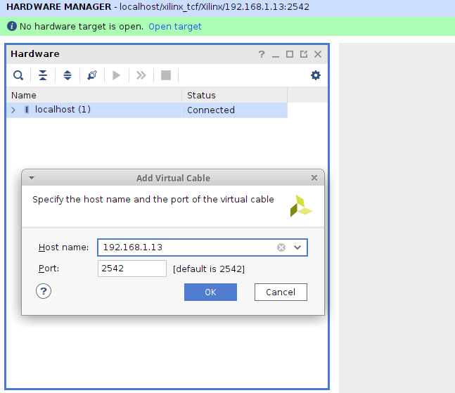

## Xilinx Virtual Cable Server for Raspberry Pi

[Xilinx Virtual Cable](https://github.com/Xilinx/XilinxVirtualCable/) (XVC) is a TCP/IP-based protocol that acts like a JTAG cable and provides a means to access and debug your FPGA or SoC design without using a physical cable.

A full description of Xilinx Virtual Cable in action is provided in the [XAPP1252 application note](https://www.xilinx.com/support/documentation/application_notes/xapp1251-xvc-zynq-petalinux.pdf).

**Xvcpi** implements an XVC server to allow a Xilinx FPGA or SoC to be controlled remotely by Xilinx Vivado using the Xilinx Virtual Cable protocol. Xvcpi uses TCP port 2542.

The **xvcpi** server runs on a Raspberry Pi which is connected, using JTAG, to the target device. **Xvcpi** bitbangs the JTAG control signals on the Pi pins. The bitbanging code was originally extracted from [OpenOCD's](http://openocd.org) [bcm2835gpio.c file](https://github.com/arduino/OpenOCD/blob/master/src/jtag/drivers/bcm2835gpio.c).

Authors: Derek Mulcahy (https://github.com/derekmulcahy), https://github.com/strongleg, Carlos (https://github.com/carlosFPGA)

Note: This software was tested on a WiFi-connected `Raspberry Pi 4 Model B` running `Raspberry Pi OS Lite (May-7th-2021)` in August-2021. The remote box was running Vivado 2021.1 against the EBAZ4205 FPGA Development Board.

Note 2: This is a portable, tested, maintained clone of https://github.com/strongleg/xvcpi, https://github.com/carlosFPGA/xvcpi/, and https://github.com/derekmulcahy/xvcpi projects.

### Tested RPi Boards

- Raspberry Pi 4 Model B
- Raspberry Pi 1 Model B+ (tested in August-2021)


### Wiring

Note: The Raspberry Pi is a 3.3V device. Ensure that the target device and the Pi are **electrically compatible** before connecting them.

JTAG uses 4 signals, TMS, TDI, TDO and, TCK. From the Raspberry Pi perspective, TMS, TDI and TCK are outputs, and TDO is an input.

Note: The default pin mappings for the Raspberry Pi header are:

```
TMS = GPIO 4, TDI = GPIO 22, TCK = GPIO 17, TDO = GPIO 27
```

The pin mappings can be changed by optional flags of `xvcpi`: -c (for TCK), -m (for TMS), -i (for TDI), -o (for TDO).

Recommended command-line:

```
sudo ./xvcpi -c 17 -m 4 -i 22 -o 27
```

Note: These pin mappings match the `./xc3sprog -c matrix_creator ...` pin mappings as well.

In addition a ground connection is required - Pin 9 is a conveniently placed GND.

Note: XVC does not provide control of either SRST or TRST and **xvcpi** does not support a RST signal.


Image Credit: Raspberry Pi Foundation


### Build Software

```
sudo apt install pigpio pigpio-tools git build-essential make
```

```
git clone https://github.com/kholia/xvcpi.git

cd xvcpi

make
```


### Usage

Start **xvcpi** on the Raspberry Pi. An optional -v flag can be used for verbose output.

```
sudo ./xvcpi -c 17 -m 4 -i 22 -o 27
```


Select the `Add Xilinx Virtual Cable (XVC)` option in the `Hardware Manager` in
Vivado and mention the `IP address` of the RPi.



More details:

Vivado connects to **xvcpi** via an intermediate software server called `hw_server`. To allow Vivado "autodiscovery" of **xvcpi** via hw_server run:

```
hw_server -e 'set auto-open-servers xilinx-xvc:<xvcpi-server>:2542'
```

Alternatively, the following tcl commands can be used in the Vivado Tcl console to initiate a connection.

```
connect_hw_server
open_hw_target -xvc_url <xvcpi-server>:2542
```

Full instructions can be found in [ProdDoc_XVC_2014 3](ProdDoc_XVC_2014_3.pdf).


### Alternate Usage

The `xc3sprog` software supports using `RPi` as a wired JTAG cable.

```
sudo apt-get install build-essential libusb-dev libftdi-dev wiringpi git cmake

git clone https://github.com/matrix-io/xc3sprog && cd xc3sprog
mkdir build && cd build
cmake ..
make
```

```
./xc3sprog -c matrix_creator -j
XC3SPROG (c) 2004-2011 xc3sprog project $Rev: 774 $ OS: Linux
Free software: If you contribute nothing, expect nothing!
Feedback on success/failure/enhancement requests:
	http://sourceforge.net/mail/?group_id=170565
Check Sourceforge for updates:
	http://sourceforge.net/projects/xc3sprog/develop

JTAG loc.:   0  IDCODE: 0x4ba00477  Desc:      ARM_Cortex-M3_r1p1-01rel0 Rev: E  IR length:  4
JTAG loc.:   1  IDCODE: 0x13722093  Desc:                        XC7Z010 Rev: A  IR length:  6
```

```
./xc3sprog -c matrix_creator -p 1 ~/top.bit
```


### Rough Performance Stats ("Speed")

If cost and ease-of-availability are the driving constraints (at the cost of
speed), then this project is 'usable' and can probably suffice. If higher
programming speed is a requirement, I recommend using `xc3sprog` with an
FT2232H board.

Other `xvcpi` forks may offer faster performance, perhaps at the cost of losing
some portability across different RPi versions.


### Documentation about GPIO

- [Low Level Programming of the Raspberry Pi in C](http://www.pieter-jan.com/node/15)

- [BCM2835 ARM Peripherals](https://www.raspberrypi.org/app/uploads/2012/02/BCM2835-ARM-Peripherals.pdf)

- [GPIO pads control](https://es.scribd.com/doc/101830961/GPIO-Pads-Control2)

- [The comprehensive GPIO Pinout guide for the Raspberry Pi](https://pinout.xyz/)

- [BCM2835, BCM2836, BCM2837, BCM2837B0, BCM2711 documentation](https://www.raspberrypi.org/documentation/computers/processors.html)


### Tips

If you see the `End of startup status: LOW` error message in Vivado, check the
FPGA power supply's voltage and current ratings.

If cost and ease-of-availability are the driving constraints (at the cost of
speed), then this project can suffice. If higher programming speed is a
requirement, I recommend using `xc3sprog` with an FT2232H board.


### Related Ideas / Projects

- https://github.com/kholia/Colorlight-5A-75B
- https://github.com/kholia/xvc-esp32
- https://github.com/kholia/xvc-esp8266


### Licensing

Upstream: https://github.com/strongleg/xvcpi and https://github.com/derekmulcahy/xvcpi projects.

This work, "xvcpi.c", is a derivative of "xvcServer.c" (https://github.com/Xilinx/XilinxVirtualCable)

"xvcServer.c" is licensed under CC0 1.0 Universal (http://creativecommons.org/publicdomain/zero/1.0/)
by Avnet and is used by Xilinx for XAPP1251.

"xvcServer.c", is a derivative of "xvcd.c" (https://github.com/tmbinc/xvcd)
by tmbinc, used under CC0 1.0 Universal (http://creativecommons.org/publicdomain/zero/1.0/).

Portions of "xvcpi.c" are derived from OpenOCD (http://openocd.org)

"xvcpi.c" is licensed under CC0 1.0 Universal (http://creativecommons.org/publicdomain/zero/1.0/)
by Derek Mulcahy.
